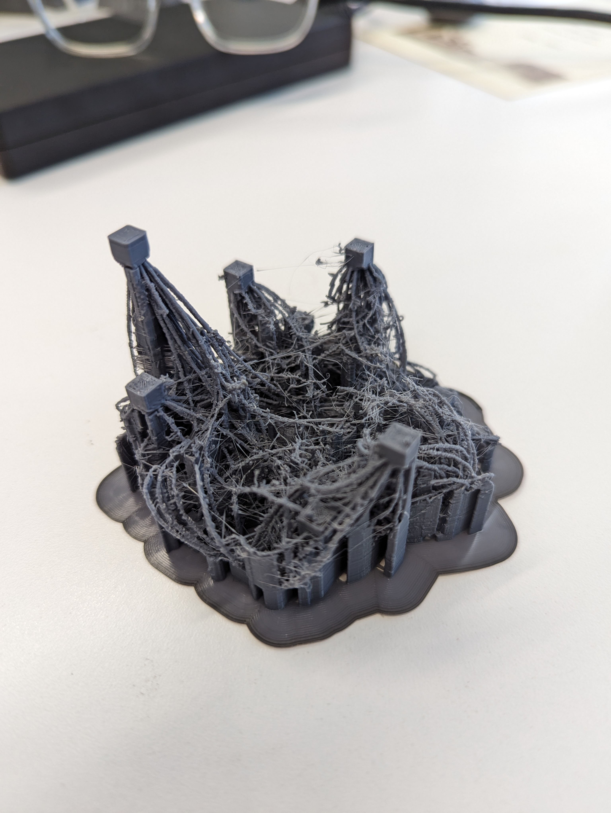

After working on the same model for all of this week and printing it, most people would classify it as a failure:

For regular 3D prints, this wouldn't be great. I can't really remove any of the supports, and it looks very stringy, with plastic remnants just sorta dangling everywhere. Honestly though, with how intricate the little arcs are, I'm pretty happy with how it turned out. I plan on trying to print this again next week using the resin printers to see if I can get any better luck.