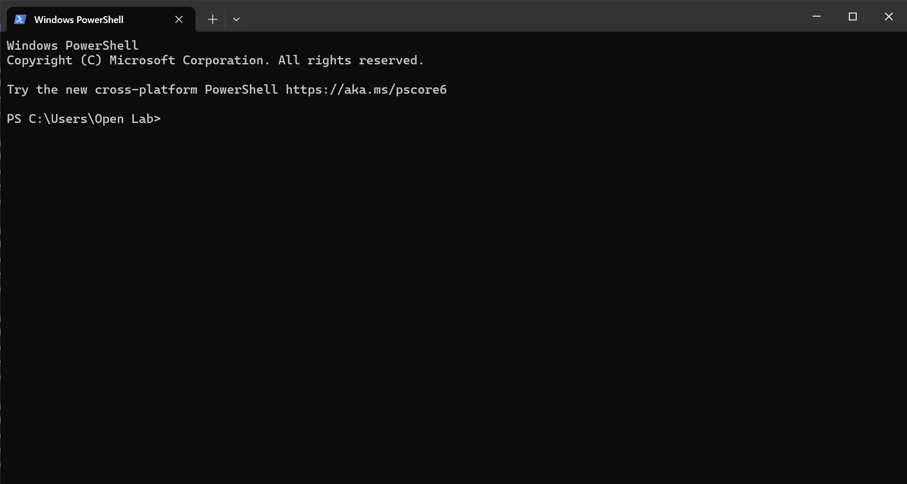
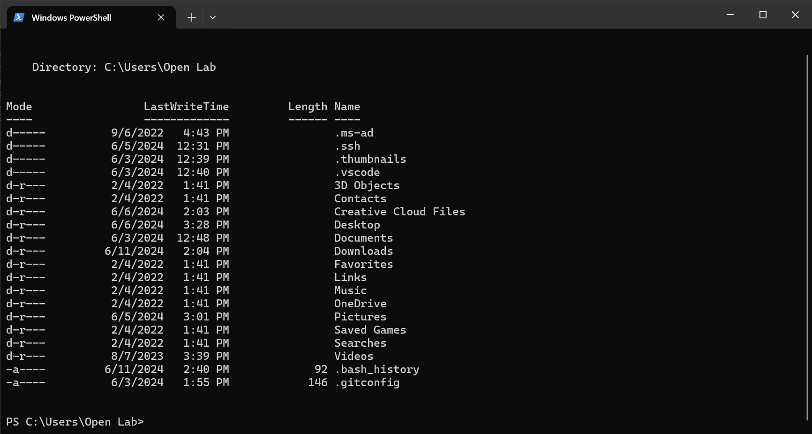

# Installing Hugo
This website runs on the static site generator [Hugo](https://gohugo.io/) with the theme [Typo](https://themes.gohugo.io/themes/typo/) by Francesco Tomaselli.

To install Hugo, on windows, you can open the Windows Terminal and run `winget install Hugo.Hugo.Extended`. Instructions for other operating systems can be found [here](https://gohugo.io/installation/).

# Installing Git
In order to run Hugo, we also need to have git installed. This doesn't require a terminal and can be downloaded [here](https://www.git-scm.com/downloads)

# Create a new site
Relaunch the terminal you used to install hugo and `cd` to the directory where you'd like to have your site. For those unfamiliar with working in a terminal, we use `cd` to navigate through the filesystem. When you open the terminal, your default directory will be under whatever user you are running Windows under. For example, the user I'm logged into to create this site is called "Open Lab", therefore I see this when I open the terminal:


To see all the folders in this directory, use `ls` to *list* all the files and folders:


Let's say I want to make the website in the Documents folder. First, I navigate in there using `cd`, and then I run the Hugo setup commands found [here](https://gohugo.io/getting-started/quick-start/):
```bash
hugo new site quickstart
cd quickstart
git init
```

Now the fun part, giving the site a theme! For this website, I'm using the Typo theme (mentioned earlier). However, there is a long [list of themes](https://themes.gohugo.io/) on Hugo's website, so feel free to browse there to find one you like instead.

In order to assign a theme to our website, we just have to run a few more commands. Note that the first line installs the theme, and if you chose a different theme, please follow that theme's installation instructions.
```bash
git submodule add https://github.com/tomfran/typo.git themes/typo
notepad hugo.toml
```

This should open up a file with notepad. We want to tell hugo to use the theme we just installed with the first command, so add the line `theme = "typo"` (replacing "typo" with whatever theme you installed if necessary) to the end of the file and then save and close the file.

With one last command, `hugo server`, you should now have a running website! For more details on where to go next (and probably a better tutorial than this one), follow [Hugo's documentation](https://gohugo.io/documentation/).